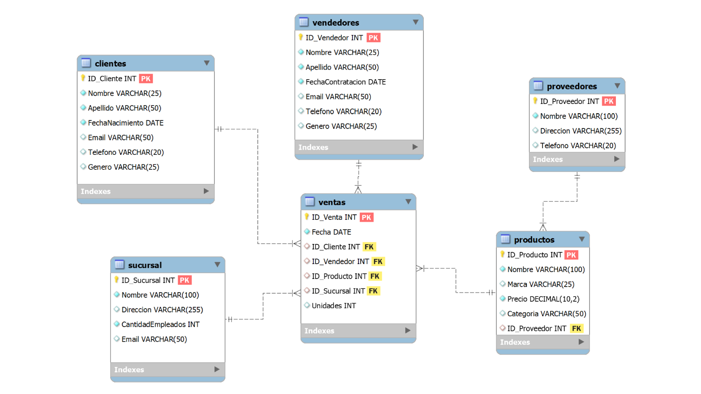

# Project 01 – Multishop Retail Sales Database Design (SQL)

## Overview

Multishop S.A is a fictitious department store that lacks a centralized data structure to manage its operational data. Information related to branches, suppliers, products, customers, sales, and sales agents is currently scattered across multiple files and formats.

This project focuses on designing and implementing a relational database using SQL to centralize and structure the company’s data, enabling efficient data management and supporting data-driven decision making.

**Data Source:** Synthetic dataset created for this project.

## General Objective
Develop a relational database that consolidates the company's operational data into a structured and normalized system to facilitate analysis and decision-making.

## Specific Objectives
- Design a normalized relational database schema with appropriate tables, relationships, and data types.
- Develop SQL queries (basic and advanced) to analyze business performance such as sales trends, branch performance, and employee productivity.

## Database Design
The database was designed to **minimize data redundancy, ensure data integrity, and enable efficient data analysis**.
The system consists of **six main tables**:

| Table | Description |
|------|-------------|
| **Sucursal** | Stores information about the store branches, including name, address, number of employees, and contact email. |
| **Vendedores** | Contains information about sales agents such as name, hire date, contact details, and gender. |
| **Proveedores** | Stores basic supplier information including name, address, and phone number. |
| **Productos** | Contains product details such as name, brand, price, category, and supplier reference. |
| **Clientes** | Stores customer information including name, birth date, gender, and contact details. |
| **Ventas** | Records sales transactions, including the product sold, quantity, and references to branch, customer, and sales agent. |

The **Ventas** table acts as the central transactional table and connects to other tables through **foreign keys**, allowing detailed analysis of sales operations.

## Entity Relationship Diagram
The following diagram illustrates the structure of the database and the relationships between the tables.

Primary Keys (**PK**) and Foreign Keys (**FK**) are used to maintain **referential integrity** across the database.

## SQL Analysis

The SQL queries used to create the database and perform the analysis are available in the repository.

- `multishop_database_creation.sql` – contains the database schema and table creation statements.
- `multishop_queries.sql` – contains analytical queries used to extract insights from the data.

## Skills Demonstrated

- SQL Database Design  
- Data Normalization  
- Primary and Foreign Keys  
- Relational Data Modeling  
- Analytical SQL Queries  

