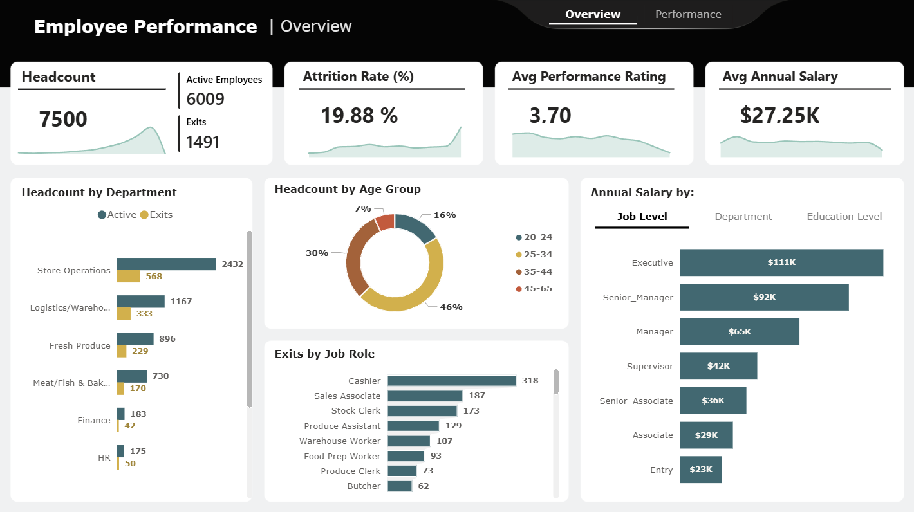

# Project 02. Employee Performance Dashboard

## Description

This project analyze employee performance, workforce distribution, and key HR metrics. The dashboard provides a comprehensive view of employee-related data, including headcount, attrition, performance ratings, salaries, and training impact, enabling data-driven decision-making in human resources.

## Key Insights

- **Attrition Analysis:** Identified an attrition rate close to 20%, highlighting potential retention challenges within the organization.
- **Department-Level Insights:** Store Operations and Logistics show the highest number of exits, suggesting areas that may require attention.
- **Workforce Distribution:** The majority of employees fall within the 25–34 age group, indicating a relatively young workforce.
- **Training vs Performance:** A positive relationship exists between training hours and performance rating, suggesting training contributes to improved employee performance.

## Tools Used

Power BI, Power Query, DAX

## Files

- Power BI file: [Employee_Performance_Dashboard](Employee_Performance_Dashboard.pbix)
- Dataset: [Employee_Performance_Dataset](Employee_Performance_Dataset.xlsb)

---

---
