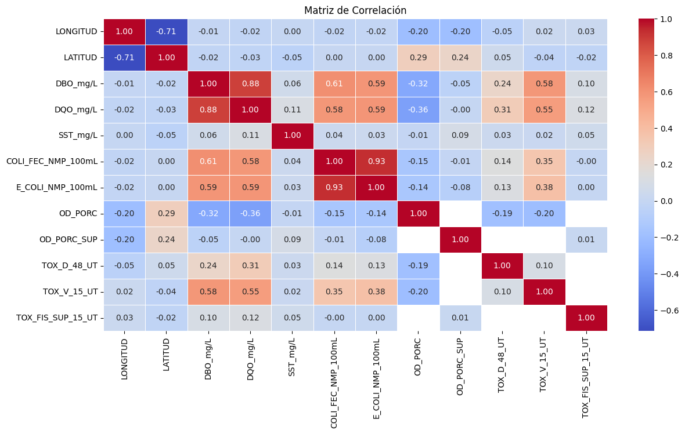
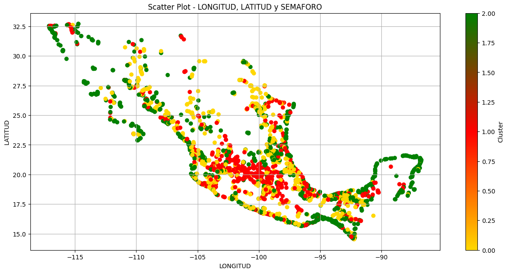

# Project 03 – Water Quality Analysis and Clustering (Machine Learning)

## Overview

Water quality monitoring generates large volumes of environmental data that can be used to understand contamination patterns and support environmental management.

This project analyzes a dataset of water monitoring sites in Mexico, containing physicochemical and microbiological parameters along with geographic information. The analysis focuses on cleaning the data, exploring its statistical characteristics, and applying machine learning techniques to identify patterns in water contamination levels.

The goal is to explore whether geographic patterns exist in contamination levels across different monitoring sites.

**Data Source:** Public water quality monitoring dataset.

## General Objective

Analyze water quality data to identify patterns in contamination levels and explore possible geographic trends using exploratory data analysis and machine learning techniques.

## Specific Objectives

- Clean and preprocess the dataset to ensure data quality and consistency.
- Perform exploratory data analysis to understand the distribution and relationships between water quality parameters.
- Apply the **K-Means clustering algorithm** to identify groups of monitoring sites with similar contamination characteristics.

## Data Preparation

Several data preprocessing steps were performed to improve data quality and ensure reliable analysis:

- Removal of empty rows
- Handling of missing values
- Elimination of columns with excessive null values
- Standardization of inconsistent text values
- Correction of incorrect data types
- Detection and verification of duplicate records

These steps ensured the dataset was suitable for statistical analysis and machine learning modeling.

## Exploratory Data Analysis

Exploratory analysis was conducted to understand the behavior of key water quality indicators.

The analysis included:

- Statistical summary of numerical variables
- Identification of outliers
- Distribution analysis of water quality parameters
- Correlation matrix to identify relationships between variables

## Correlation Analysis

A correlation matrix was used to explore relationships between key water quality indicators.

## Machine Learning Model

To identify patterns in contamination levels across monitoring sites, the **K-Means clustering algorithm** was applied.

Two methods were used to determine the optimal number of clusters:

- **Elbow Method**
- **Silhouette Method**

Both approaches suggested an optimal clustering around **k = 3**, leading to the identification of three distinct groups of monitoring sites.

## Clustering Analysis

The clustering analysis incorporated both **geographic variables** (latitude and longitude) and **contamination indicators** to explore spatial patterns in water quality.

The results revealed three clusters representing different contamination profiles across monitoring locations.

## Repository Structure

- [water_quality_machine_learning](water_quality_machine_learning.ipynb) – Data cleaning, exploratory analysis, and machine learning implementation
- [Aguas_superficiales_2020.csv](Aguas_superficiales_2020.csv) – Dataset

## Skills Demonstrated

- Data Cleaning  
- Exploratory Data Analysis (EDA)  
- Statistical Analysis  
- Correlation Analysis  
- Machine Learning (K-Means Clustering)  
- Python Data Analysis (Pandas, NumPy, Scikit-learn)  
- Data Visualization
