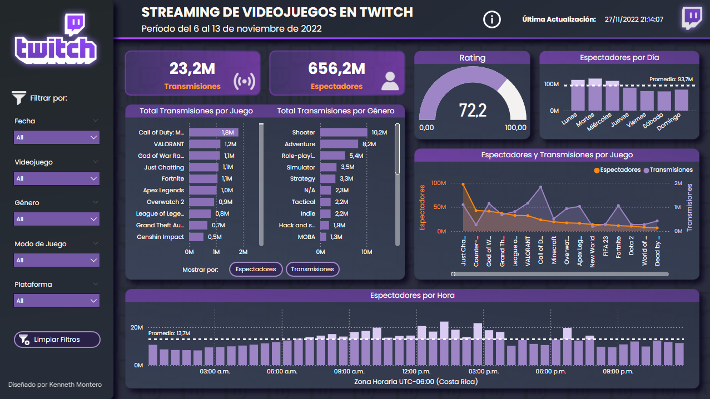

# Project 04 - Twitch Streaming Analytics Dashboard

## 📌 Description

This project analyzes video game streaming activity on Twitch through an interactive Power BI dashboard.

It provides insights into total streams, audience engagement, game popularity, and viewing patterns across different dimensions such as game, genre, day, and time, enabling a deeper understanding of user behavior and platform trends.

## 💡 Key Insights

- **Audience vs Streaming Patterns:** Some games show high viewership despite lower streaming volume, suggesting higher audience demand relative to supply.
- **Genre Distribution:** Shooter and Adventure genres dominate the platform, concentrating the majority of streaming activity.
- **Daily Trends:** Viewership remains relatively stable throughout the week, with slight peaks on specific days.
- **Hourly Behavior:** Audience peaks around midday and early afternoon, reflecting user consumption patterns aligned with leisure hours.
- **Engagement Metric:** The overall rating suggests a solid balance between content supply and audience demand.

## 📊 Business Value

This dashboard helps:

- Identify trending games and genres  
- Understand audience behavior patterns  
- Detect gaps between content supply and demand  
- Support strategic decisions for content creators and streaming platforms  

## 🛠️ Tools Used

  

## 📂 Files

- Power BI file: [Download .pbix](Twitch_Dashboard.pbix)  
- Datasets:  
  - [Streams Info Dataset](StreamsInfo_Dataset.xlsx)  
  - [Games Info Dataset](GamesInfo_Dataset.xlsx)  

## 📷 Dashboard Preview

---

